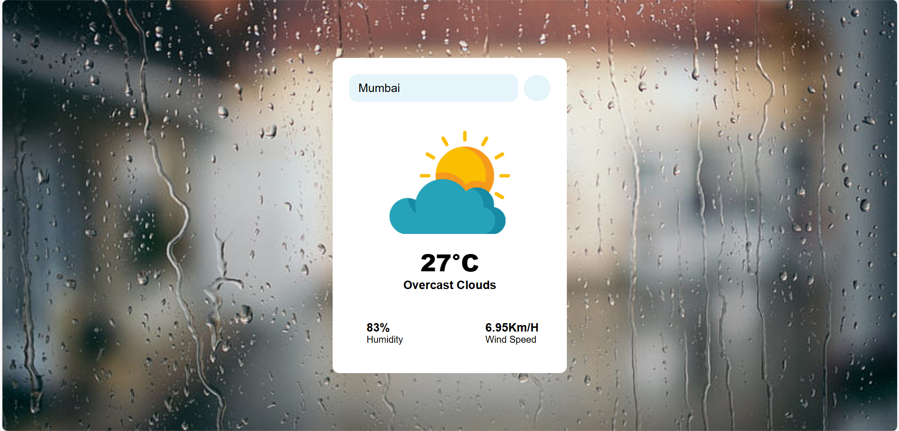

# 🌦️ Weather Web Application

A sleek and interactive weather web app built using **HTML**, **CSS**, and **JavaScript**, that fetches real-time weather data using the **OpenWeatherMap API**.

## 🌟 Features

- 🌍 Search weather by **city, state, or country**
- 📡 Fetches **real-time weather data** from OpenWeatherMap API
- 🌡️ Displays temperature, humidity, weather condition, and more
- 🎨 Clean and modern UI with animated weather icons
- 🧠 Error handling for invalid locations or API issues

## 📂 Project Preview

